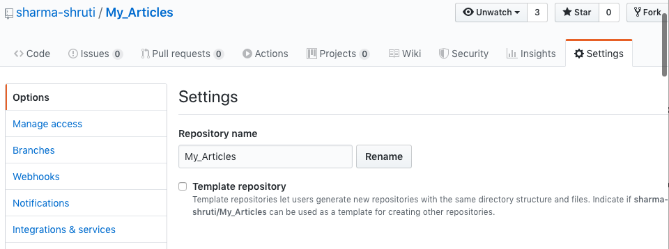
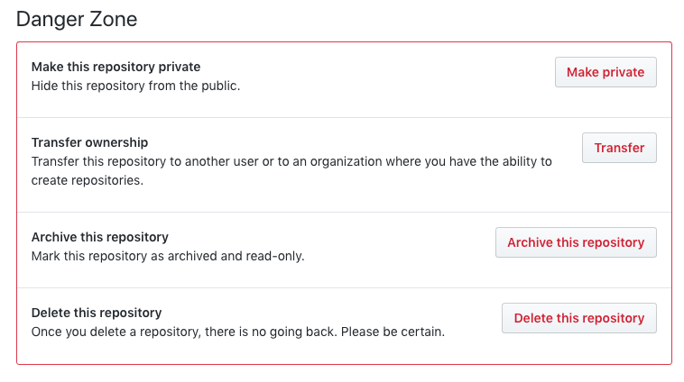

# List of GitHub best practices 

- **Don’t git push straight to master.**
All commits should be pushed to master through pull requests.

- **Don’t commit code as an unrecognized author.** Having commits with unrecognized authors makes it more difficult to track who wrote which part of the code.
- **Define code owners for faster code reviews.** Code Owners feature helps to define which teams and people are automatically selected as reviewers for the repository.
[About code owners](https://help.github.com/en/github/creating-cloning-and-archiving-repositories/about-code-owners)

- **Don’t commit local config files into source control.** You must refrain from committing your local config files to version control. Usually, those are private configuration files you don’t want to push to remote because they are holding secrets, personal preferences, history or general information that should stay only in your local environment.

- **Archive dead repositories** It is better to clean up those repos which are no longer in use to avoid the risk of other people using them. The best practice is to archive them, i.e. make them “read-only” to everyone.
*To archive a repository go to the "settings" tab within your repository and then scroll to the bottom to archive (as shown below)*

- **Use a branch naming convention**
- **Delete stale branches**
- **Keep branches up to date**
- **Remove inactive GitHub members**
- **Enable security alerts** - GitHub now tracks reported security vulnerabilities in some dependencies and will even suggest fixes for you. This is turned on automatically for all public repositories, but if your repository is private, you’ll need to opt in manually. [Click here for more information](https://help.github.com/en/github/managing-security-vulnerabilities/about-security-alerts-for-vulnerable-dependencies)
