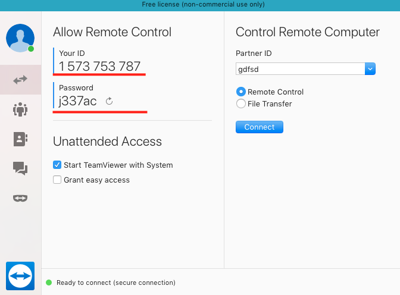

# What is TeamViewer?
TeamViewer is a software application that allows remote control; desktop sharing and file transfer between computers. This enables you to support customers, work with colleagues remotely, and connect to your own device or support friends and family members when needed.
TeamViewer is compatible with multiple platforms, including Windows, macOS, Linux, Chrome OS, iOS, Android, universal Windows platform and BlackBerry.

# Features of TeamViewer
- **Remote Control** - In the remote control window you can control your partner’s computer as if you were sitting in front of it. You can use your keyboard and your mouse for controlling your partner’s computer.  
- **File Transfer** - It allows sharing of files between computers using conventional methods such as file manager, context menu, drag & drop and linkable file boxes to cloud storage provider.
- **Session recording** - During the session you have the possibility to record your remote session as movie. The recording is executed in TeamViewer´s own .tvs file format. For this reason it is ensured that the file is unchangeable and also can be used for purposes of revision.
- **Presentation** – It can be used for giving presentation. In presentation mode a little control window gives you control over the session. At any given time you can pause the presentation, so you can do things on your desktop that your partner should not see. There are many features available like whiteboard or drawing palette, disabling remote input, optimize speed, quality, settings etc
- **Multi Lingual** - TeamViewer is available in more than 30 languages and supports international keyboards, becoming the ideal solution for international use.
- **Conversation** - Instant messaging function includes chat group, web chat, offline messaging, chat history, fixed chat group, chat initiated by customers from service case, full support for Mobile devices and end-to-end encryption.

# How does the TeamViewer work?
After installing and signing in to the TeamViewer, you get an ID and password for your computer to allow remote access (as shown below). Likewise, you can take control of someone else’s computer provided you have their ID and password. After entering the correct ID & password, the remote connection gets established. 

# How secure is TeamViewer?
TeamViewer software is very safe and does not pose any danger to your computer. Because this is quite prestigious and well-known software, the security is quite high. All TeamViewer versions use full encryption based on 2048bit RSA private/public key exchange and 256 Bit AES session encoding. This uses the same security level as https/SSL and is considered completely safe by today's standards. 

# How do I know if someone is using TeamViewer on my computer?
You can tell if someone is connected to your computer via Teamviewer if the Teamviewer panel is visible. On a Mac, it’s in the upper right corner. On Windows, it’s the lower right corner. If you do use Teamviewer to connect to your own computer, but don’t want others to connect, then change the unattended access password.

# Alternatives to TeamViewer
Even though TeamViewer is a popular professional choice for remote management for external service providers it also has its limitations in terms of security and image quality, so many users are less than 100% satisfied. Below are some of the tools used for the same purpose
- [WebEx Meetings](https://www.webex.com/)
- [Ammyy Admin](http://www.ammyy.com/en/)
- [Mikogo](https://www.mikogo.com/)
- [ThinVNC](https://www.tightvnc.com/)
- [AnyDesk](https://anydesk.com/en)
- [UltraVNC](https://www.uvnc.com/)
- [Chrome Remote Desktop](https://remotedesktop.google.com/)
